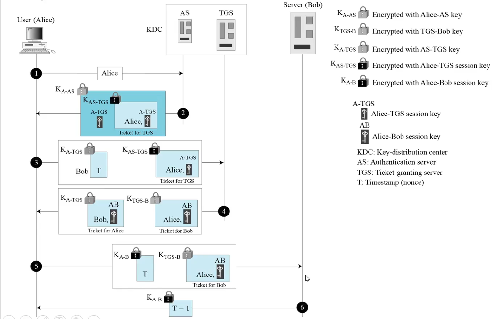

# Simple-Kerberos
This is a simple implementation of the Kerberos protocol using socket programming and Fernet module of the cryptography library. Kerberos is a computer-network authentication protocol that works on the basis of tickets to allow nodes communicating over a non-secure network to prove their identity to one another in a secure manner. It consists of the following steps:   

The corresponding steps are also mentioned in the code files as comments. The role of Authentication Server (AS) and Ticket Granting Server (TGS) has been merged into one server in the code. To use the code, run the following in the given order:
1. [Server.py](Server.py)
2. [KDC.py](KDC.py)
3. [Client.py](Client.py)
